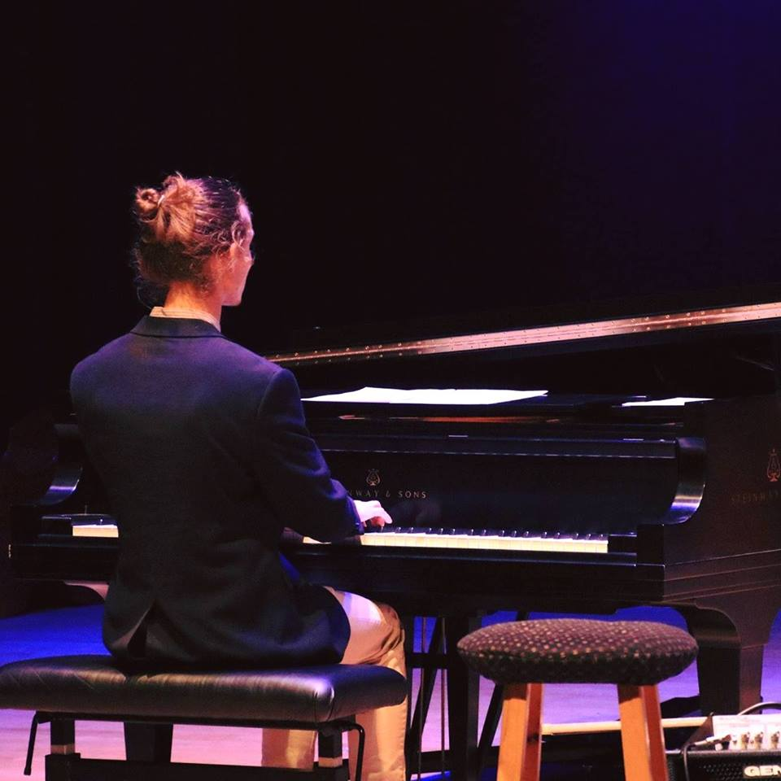

I am an engineering student and pianist based in the Bay Area in California. I am available to play piano at events in and around the San Francisco Bay Area. I am also currently looking for an engineering position relating to robotics and/or aerospace beginning after I graduate from UC Santa Cruz in June.

<section id="interests">
	

		

			<header class="major">
				<h3>Engineering</h3>
			</header>
			
I have loved building things for as long as I can remember. I was the type of kid who often spent hours at a time tinkering with LEGO or other types construction projects. That interest in building and creative problem solving has fit very well with the Robotic major at UC Santa Cruz, as I suspected it would. My interest in the aerospace industry, while also a lifelong passion, has only increased since working on a <a href="">microsatellite senior design project</a>, which has provided a ground-up perspective into the process of launching a craft into orbit.

			
			<header class="major">
				<h3>Music</h3>
			</header>
			
I started playing piano in 2007, and jazz in about 2009. Since then, I have had the pleasure of playing with a collection of Bay Area jazz scene locals, including <a href="http://www.abcarian.com/main/" target="_blank">Ravi Abcarian</a>, <a href="https://richardhowellandsuddenchanges.com/" target="_blank">Richard Howell</a>, <a href="https://www.maxschwartzmusic.com/" target="_blank">Max Schwartz</a>, <a href="https://www.montereysymphony.org/person-stan-poplin-42.htm" target="_blank">Stan Poplin</a>, and most recently <a href="http://ashwinbatish.com/" target="_blank">Ashwin Batish</a>. My Santa Cruz-based jazz trio Triumvirate has released <a href="">two albums</a> featuring <a href="http://www.keshavbatish.com/home-2/" target="_blank">Keshav Batish</a> and Gabe Meacham, among others.

		

		

			
		

	

</section>

<section id="bio">
	

		

			<header class="major">
				<h3>Early Life</h3>
			</header>
			
I grew up in Berkeley, California. I homeschooled for much of my academic career up until high school, an experience which taught me the value of curiosity and independent learning. After graduating from Berkeley High School in 2014, I was intrigued by the Jack Baskin school and jazz minor at UC Santa Cruz, and decided to move there to get my bachelor's among the redwoods.

		

		

			<header class="major">
				<h3>Education</h3>
			</header>
			<ul class="alt">
				<li>Bachelor of Science in Robotics Engineering, University of California, Santa Cruz.</li>
				<li>Expected graduation in June 2019.</li>
			</ul>
		

		

			<header class="major">
				<h3>Other Accomplishments</h3>
			</header>
			<ul class="alt">
				<li>I had the honor of playing at the 2017 Monterey Jazz Festival with the UC Santa Cruz Jazz Combo.</li>
				<li>I am a member of the engineering honor society Tau Beta Pi.</li>
				<li>The Porter Gulch Review published my short story, <a href="https://www.cabrillo.edu/publications/portergulch/ONLINE_PGR_2015.pdf#page=39" target="_blank">Think of the Children</a>, in 2014.</li>
			</ul>
		

	

</section>