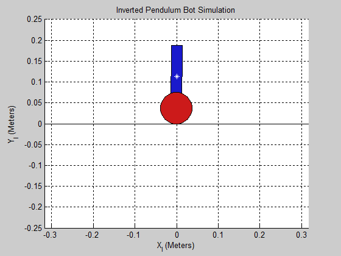

<section id="about">
	

		

			

				<header class="major">
					<h2>About</h2>
				</header>
				
The inverted pendulum is a classic feedback control problem. The coupled physical system exhibits complex behavior which can make it difficult to control. In this project I aim to tackle the problem from the ground up, using a derived kinematic model to simulate the effects of different feedback control techniques on the system. Eventually, I will build and program an inverted pendulum bot from scratch.

			

			

				<header class="major">
					<h2>Source Code</h2>
				</header>
				<a href="{{ page.github-url }}">GitHub</a>
			

		

	

</section>

<section id="simulation">
	

		<header class="major">
			<h2>Simulation</h2>
		</header>
		

			

				
A proof-of-concept Matlab simulation shows that two nested PID controllers can successfully drive the robot to a desired position.

			

			

				
			

		

	

</section>