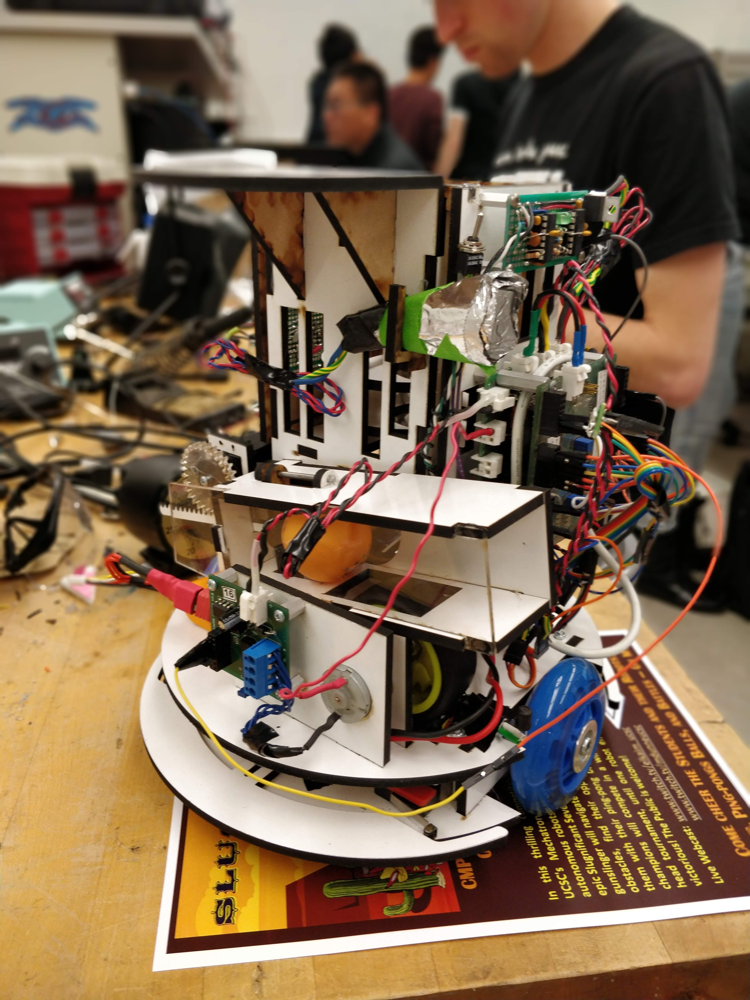

<!-- <section id="about">
	

		<header class="major">
			<h1>About SlugSat</h1>
		</header>
		
<a href="https://slugsat.soe.ucsc.edu/home-page">SlugSat</a> is a student-run <a href="http://www.cubesat.org/">CubeSat</a> electrical and computer engineering senior design project at the Jack Baskin School of Engineering at UC Santa Cruz. The project aims to put a microsatellite in low Earth orbit on a very low budget. Galen leads the project's Mechanical team, which is working on an attitude control system to sense and adjust the craft's orientation in space.

	

</section> -->

<section id="one">
	

		

			

				<!--
				<header class="major">
					<h2>Mechatronics Class</h2>
				</header>
				-->
				
A description of mechatronics.

				<header class="major">
					<h3>Game Rules</h3>
				</header>
				
The robot had to be able to navigate the field and shoot ping pong balls at opponents.

				<header class="major">
					<h3>Game Rules</h3>
				</header>
				
The robot had to be able to navigate the field and shoot ping pong balls at opponents.

			

			

				
			

		

	

</section>