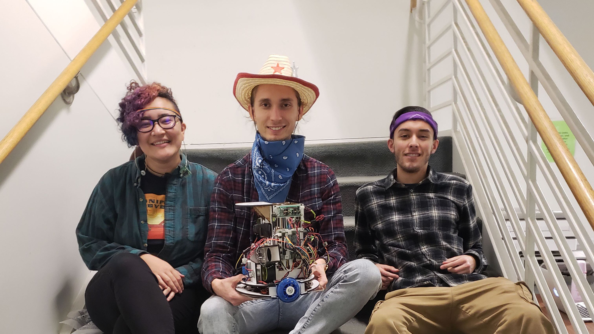

<!-- <section id="about">
	

		<header class="major">
			<h2>Checkoff Video</h2>
		</header>
	

</section> -->

<section id="about">
	

		<header class="major">
				<h2>About Mechatronics</h2>
			</header>
		
CMPE118: Intro to Mechatronics, referred to as mechatronics or "mech," is maybe the most infamous class at UCSC. Students from all the school's engineering disciplines know its reputation as a sort of temporal vortex which sucks in friends and colleagues. A cornerstone of the class is its final project, in which student teams build autonomous robots to compete against one another in instructor-designed games.

	

</section>

<section id="rules">
	

		<header class="major">
			<h2>Game Rules</h2>
		</header>
		

			

				
The game is played on flat field marked by tape. The field has randomly placed obstacles which change position every round. To win the game, a robot must:

				<ol>
					<li>Navigate to the back end of the field.</li>
					<li>Locate and fire at opponent robots. Two hits to the body or one hit to the can wins the match.</li>
					<li>Stay within the boundary lines of the field and do not stall for more than five seconds.</li>
				</ol>
			

			

				

					<iframe src="https://drive.google.com/file/d/1Tj-PVqJTNC0hqsFZBgiU8-32OnltNKka/preview" allowfullscreen style="position:absolute; left:0; top:0; width:100%; height:100%"></iframe>
				

			

		

	

</section>

<section id="rules">
	

		<header class="major">
			<h2>Project Team</h2>
		</header>
		

			

				
I had the pleasure of working with Mattiana Lang (left) and Tristan Rhoan (right) during the last half of Intro to Mechatronics. Over our five weeks working together, we collaborated to create the mechanical design, electronics, and control software of our robot from scratch. Our robot could consistently complete the game on the lab's test field (shown above).

			

			

				
			

		

	

</section>