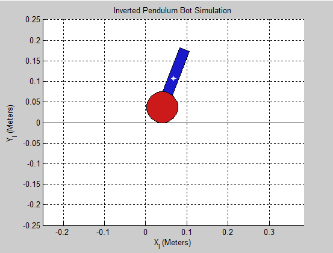
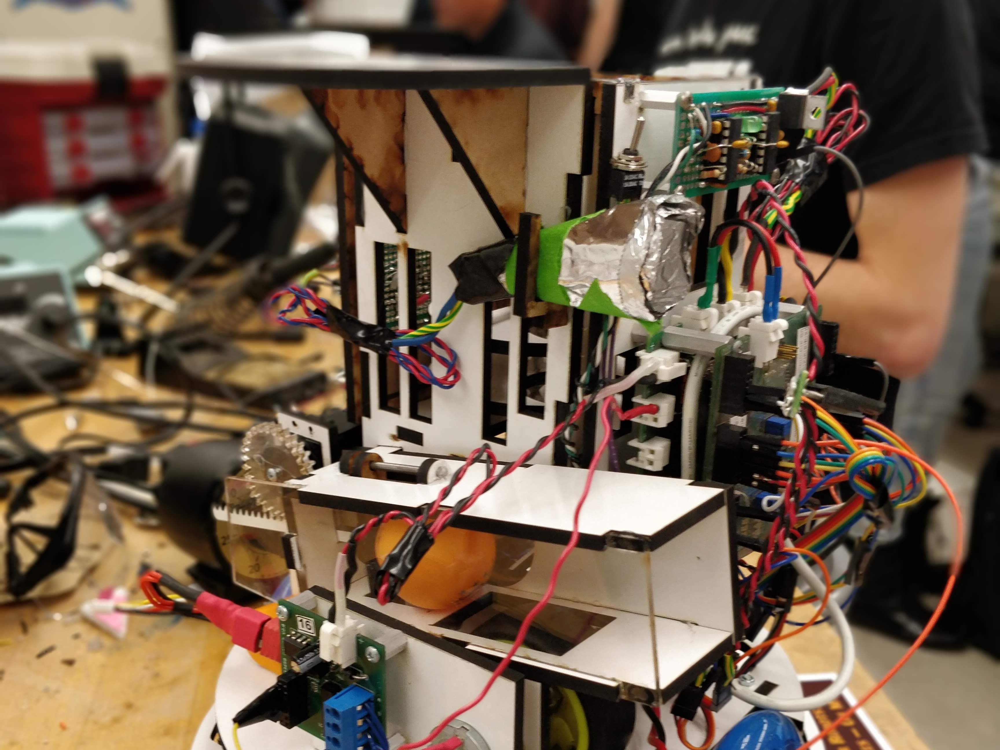

<!-- Main -->

<!-- List of projects (one) -->
<section id="one" class="spotlights">
	<section>
		
		

			

				<header class="major">
					<h3>SlugSat</h3>
				</header>
				
Microsatellite senior design project.

				<ul class="actions">
					<li><a href="slugsat.html" class="button">Read more</a></li>
				</ul>
			

		

	</section>
	<section>
		
		

			

				<header class="major">
					<h3>Inverted Pendulum Bot</h3>
				</header>
				
A configurable, autonomous Segway-like robot. Currently in progress.

				<ul class="actions">
					<li><a href="inverted-pendulum.html" class="button">Read more</a></li>
				</ul>
			

		

	</section>
	<section>
		
		

			

				<header class="major">
					<h3>Mechatronics Project</h3>
				</header>
				
A mobile autonomous robot built for CMPE118: Intro to Mechatronics.

				<ul class="actions">
					<li><a href="mechatronics.html" class="button">Read more</a></li>
				</ul>
			

		

	</section>
</section>

