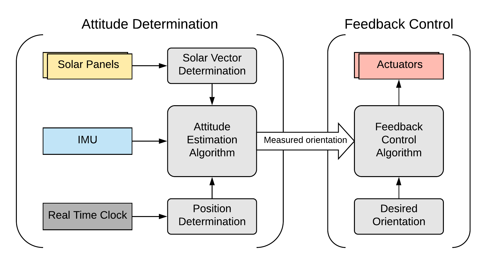
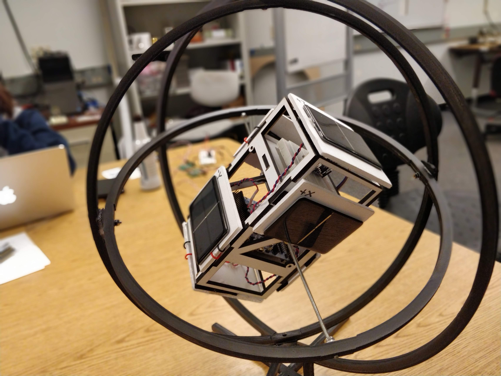
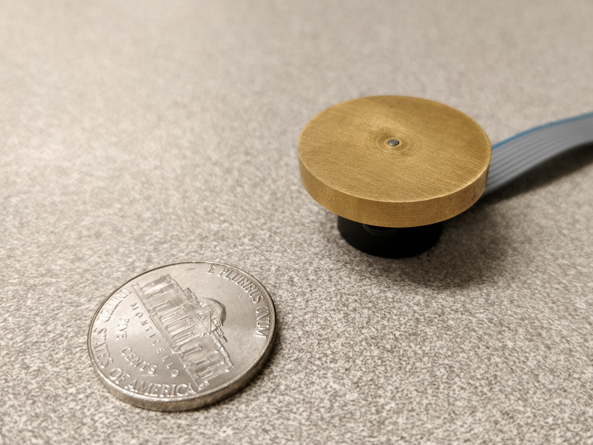
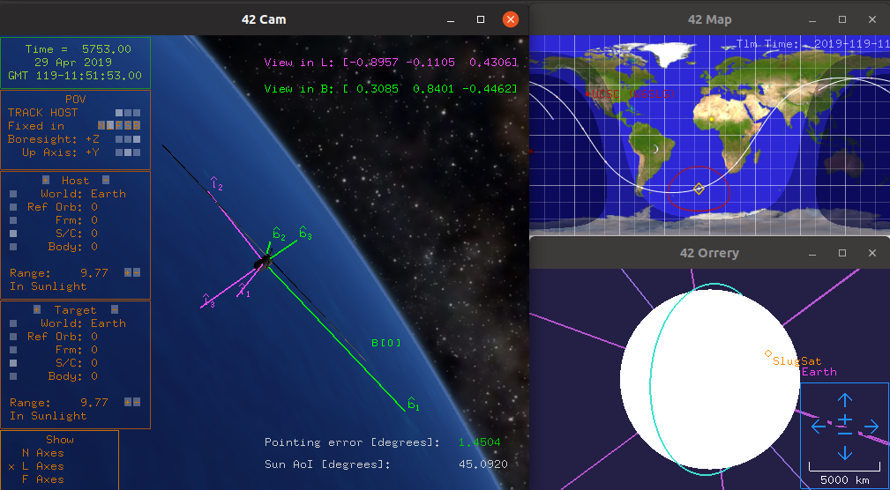

<section id="about">
	

		<header class="major">
			<h2>About</h2>
		</header>
		
<a href="https://slugsat.soe.ucsc.edu/home-page" target="_blank">SlugSat</a> is a student-run <a href="http://www.cubesat.org/" target="_blank">CubeSat</a> design project at the Jack Baskin School of Engineering at UC Santa Cruz which aims to put an undergraduate-developed microsatellite in low Earth orbit on a very low budget. The project's goals are twofold: first, to carry a HF linear transponder for use by amateur radio enthusiasts; and second, to gather data from terrestrial gamma ray flashes for the Santa Cruz Institute of Particle Physics. The 2018-2019 academic year was SlugSat's third year in development and second year as a full satellite project&#8212;the goal for the year was to create SlugSat's first flat-sat prototype, or a copy of the satellite's systems running flat on a table. As leader of SlugSat's Attitude Control System team, I worked on initial prototypes of the sensors, actuators, and algorithms used to sense and adjust the satellite's orientation in space.

	

</section>

<!-- Attitude Control System (One) -->
<section id="one">
	

		<header class="major">
			<h2>Attitude Control System</h2>
		</header>
		

			

				
SlugSat's Attitude Control System (ACS) is reseponsible for maintaining the nadir pointing attitude required by the satellite's payloads. To do this, the system uses a combination of sensors, actuators, and feedback control logic, together allowing for closed-loop control of the satellite's orientation. SlugSat uses course sun sensors and an Inertial Measurement Unit (IMU) to determine its orientation in space, while reaction wheels and magnetic torque rods provide the means to alter its attitude. State-machine-controlled sensor fusion and feedback control logic runs continuously on the SlugSat's on-board computer, constantly updating output to the actuators based on the state and orientation of the satellite.

			

			

				
			

		

	

</section>

<!-- Matlab Simulations (Two) -->
<section id="two">
	
	
		<header class="major">
			<h2>Matlab Simualtions</h2>
		</header>
		
We created a simple dynamic simulation in Matlab to test feedback control algorithms for the ACS. The simulation models the rotational dynamics of the satellite and its actuators, including configurable disturbance torques. The physical properties of the satellite are based on estimations of the mass distribution of SlugSat's components and an initial prototype of the HF (15 meter band) antenna supporting the linear transponder. Shown below, the Matlab simulation demonstrates that the feedback controller used in the ACS can rotate to and maintain a desired attitude.

		

			

				
			

			

				
			

		

		
<i>Note: the animations above are not in real time.</i>

	

</section>

<!-- Hardware Prototypes (Three) -->
<section id="three">
	

		<header class="major">
			<h2>Hardware Prototypes</h2>
		</header>
		
In addition to simulations, year 3's ACS prototype included prototypes of the sensors and actuators used on-board the satellite. The final ACS will use three reaction wheels (and likely more to safeguard against component failure), three torque rods, and space-grade sensor electronics. The year 3 prototypes include only one reaction wheel, one torque rod, off-the-shelf solar panels, and an IMU development board.

		
		

			

				
SlugSat's initial sensor prototype, shown to the left, houses an IMU and STM32 Nucleo development board inside a box scaled to replicate SlugSat's exterior. The box has solar panels mounted on each side which, when exposed to a single directional light source, allow the "satellite" to find a course sun vector. The on-board microcontroller reads data from the IMU and solar panels, runs an attitude estimation algorithm (similar to an extended Kalman filter), and sends orientation data to a PC for analysis. The complete test assembly also includes a dark box to remove interference from external light and a Helmholtz coil to allow precise control over the magnetic field inside of the test fixture.

			

			

				
			

		

		
		

			

				
In addition to sensor prototypes, we built and tested one copy of each type of actuator used by the ACS: one magnetic torque rod, and one reaction wheel. The torque rod was constructed by winding wire around a core made of a nickel-iron-molybdenum alloy with very high permeability. These actuators generate torque by utilizing the geomagnetic field surrounding Earth, and are very important because they can change the net angular momentum of the satellite. The reaction wheel prototype, shown here, was made by mating a metal flywheel onto a brushless DC motor. Reaction wheels generate more torque than torque rods, are more power efficient, and are not constrained by the direction of the geomagnetic field, but work by utlizing the conservation of momentum, meaning that they cannot change the net momentum of the satellite.

			

			

				
			

		

	

</section>

<!-- Flat-Sat (Four) -->
<section id="four">
	

		<header class="major">
			<h2>Flat-Sat</h2>
		</header>
		
The culmination of an academic year of work on the project, SlugSat's flat-sat is an integrated system comprised of components from the power, linear transponder, on-board computer, and of course attitude control subsystems. 

		

			
		

		
		

			

				
We used <a href="https://software.nasa.gov/software/GSC-16720-1" target="_blank">42</a>, an open-source flight simulator developed by NASA, to test the ACS software on the flat-sat. 42 offers an accurate model of the disturbances acting upon the satellite in low Earth orbit, making it useful for testing the performance of the ACS. We modified the program to simulate readings from SlugSat's sensors, model the effects of its actuators on the satellite, and communicate with the flat-sat flight software. Running 42 alongside the ACS flight software creates a hardware-in-the-loop simulation, where the flat-sat directly controls the simulated satellite. This allowed us to verify that the ACS performs within specifications in a variety of simulated low Earth orbits.

			

			

				
			

		

	

</section>