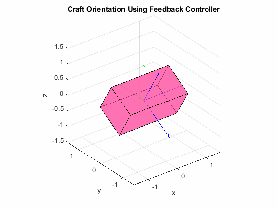
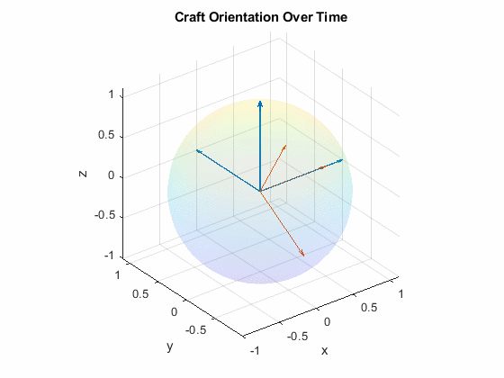

<section id="about">
	

		<header class="major">
			<h2>About</h2>
		</header>
		
<a href="https://slugsat.soe.ucsc.edu/home-page" target="_blank">SlugSat</a> is a student-run <a href="http://www.cubesat.org/" target="_blank">CubeSat</a> electrical and computer engineering senior design project at the Jack Baskin School of Engineering at UC Santa Cruz. The project aims to put a microsatellite in low Earth orbit on a very low budget (~$12,000). As leader of SlugSat's Mechanical team, I am working on an attitude control system to sense and adjust our satellite's orientation in space.

	

</section>

<!-- Attitude Control System (One) -->
<section id="one">
	

		<header class="major">
			<h2>Attitude Control System</h2>
		</header>
		
The Attitude Control System (ACS) uses course sun sensors and an Inertial Measurement Unit (IMU) to determine the satellite's orientation in space. Reaction wheels and magnetic torque rods provide the means to alter the craft's attitude. ACS Matlab simulations show that a feedback controller can move the satellite into a desired orientation (shown below).

		
		

			

				
			

			

				
			

		

	

</section>

